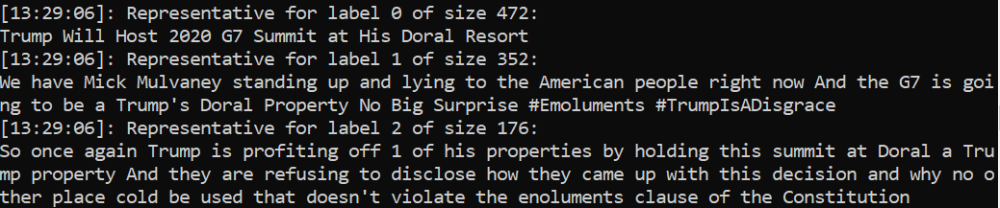
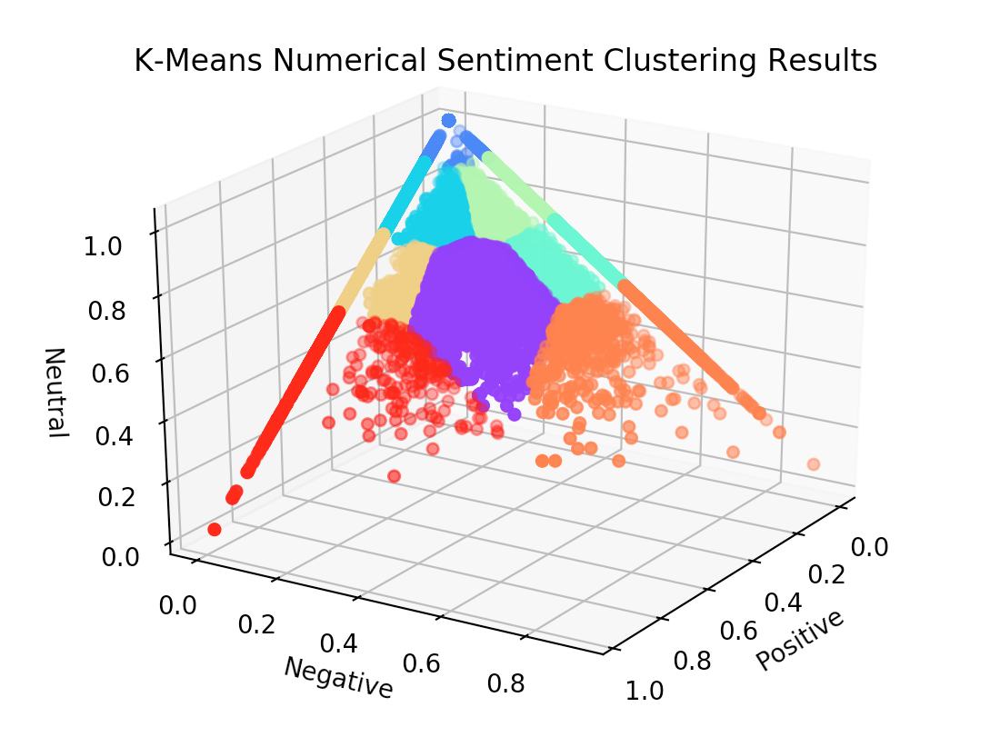
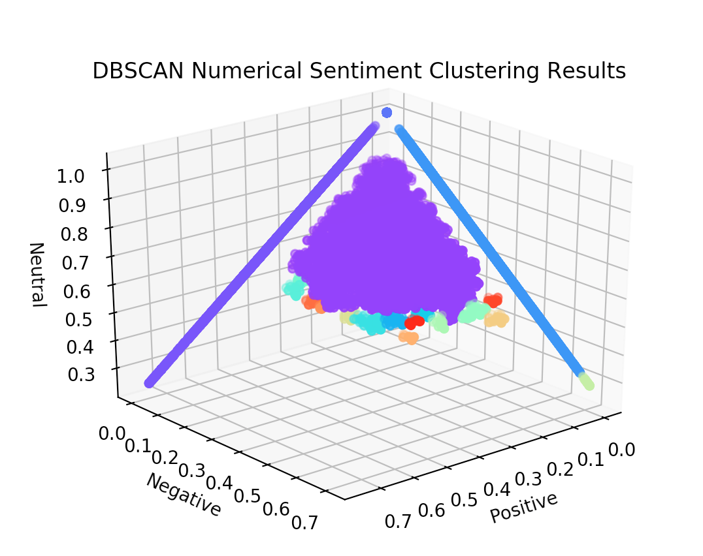

# zeitgeist
For Python 3.6+

Analyze trending twitter topics and use NLP to generate a summary

## Installation

1. Install requirements
        
        ```
        pip install -r requirements.txt
        ```
        
1. Install spaCy requirements (requires administrator privleges)
        
        ```
        python -m spacy download en
        ```
        
1. Create a file called `driver` with your Twitter API secrets, per below.
        
        ```
        import os
        import zeitgeist

        if __name__ == '__main__':
            
            os.environ['CONSUMER_KEY'] = '<CONSUMER_KEY>'
            os.environ['CONSUMER_SECRET'] = '<CONSUMER_SECRET>'
            os.environ['ACCESS_TOKEN'] = '<ACCESS_TOKEN>'
            os.environ['ACCESS_TOKEN_SECRET'] = '<ACCESS_TOKEN_SECRET>'
            
            zeitgeist.main()
        ```
        
1. Run the full program
        
        ```
        python driver --full
        ```
        
## Goals

- grab corpus from live twitter data (trending hashtags)
- areas of analysis:
    - sentiment analysis of corpus (tbendlin)
        - [x] are trending topics generally positive or negative?
        - [ ] what is the distribution of the sentiment of individual tweets?
        - [x] can we locate particularly "outlier" tweets using sentiment?
    - topic analysis (pgalatic)
        - [x] clean data (remove urls / hashtags)
        - [x] what tweets in this trending hashtag are the most important?
            - [x] can we cluster tweets and then pick tweets that are representative of those clusters?
        - [ ] what is the trending hashtag about in a general sense, and can we summarize that programmaticaly?
        - [ ] what types of hashtags are more or less difficult to analyze in this way?
    - generating an "abstract" of the trending hashtag (qxh5696)
        - [ ] can we make a short paragraph describing a hashtag programmatically?
    - summary statistics
        - [ ] what words are the most common?
        - [ ] what emojis (if applicable) are the most common?
        
## Agenda

- [x] 9/19:
    - [x] pgalatic: Implement the data collection algorithm
    - [x] tbendlin: 1st draft of phase 1 report
    - [x] qxh5696: psuedocode for abstract generation algorithm + its source papers
- [x] 9/26
    - [x] pgalatic: phase 1 report edited and submitted and add data cleaning if possible
    - [x] tbendlin: plan sentiment analysis portion
    - [x] qxh5696: carryover from 9/19
- [x] 10/10
    - [x] pgalatic: add geolocation data to scraped tweets (coordinates if possible)
    - [x] tbendlin: add overall public opinion of tweets
    - [x] qxh5696: hook summarization program into zeitgeist.py and process data
- [x] 10/17
    - [x] pgalatic: add agglomerative clustering using word vectors and cosine similarity
        - Do we want to add spellchecking for text normalization?
    - [x] tbendlin: add kmeans/density clustering using sentiment
    - [x] qxh5696: improve summarization
- [x] 10/24
    - Discussion / planning on how to condense our report into a PDF or image output document
- [ ] 10/31
    - [ ] pgalatic: 
        - [ ] generate infographic image with tweet information organized in a visually pleasant way
        - [ ] add random control
    - [ ] tbendlin:
        - [ ] report 3 most extreme clusters (most positive, most negative, most neutral)
        - [ ] also report 3 largest clusters that are not the same as the most extreme clusters
        - [ ] report semiment value of cluster centers as well as the tweets represented by the center (for color coding)
        - [ ] add random control
            - [ ] pick six random tweets and sort by sentiment so that they can "mock" as the centers of the six clusters described above
    - [ ] qxh5696: add random control
        - [ ] change summary to be up only M characters (say, 500) for consistency
        - [ ] add parameter that, when true, will return a summary of random sentences that add up to M characters

### Data Collection Pipeline

```
python driver --gather
```
* Data is first gathered from tweets unlceaned with these attributes IN ORDER and placed in a CSV file in ~/raw/:
    * timestamp
    * text
    * geolocation
```
python driver --purify=[HASHTAG]
```
* Data from target hashtag is extracted from ~/raw/HASHTAG.csv and preprocessed, removing:
    * stopwords
    * non-alphanumeric characters excluding ['@#]
```
python driver --cluster=[HASHTAG]
```
* Data from target hashtag is read into memory and clustered. The most representative tweets are printed to console and a visualization is saved to /report/.
```
python driver --summarize=[HASHTAG]
```
* Data from target hashtag is read into memory and summarized. The summary is then printed to console.

### Experimental Design

Because we aim to generate a helpful report that will be read by humans, it must have a common basis of comparison. The following experimental design is based on the following criteria of control.
1. The programmatic summary is generated by looking at statistics of word and sentence frequency and then choosing the most relevant sentences to report. The random summary is generated by reporting random sentences.
1. The programmatic clustered tweets are generated by performing agglomerative clustering over a subset of tweets and then reporting the tweets closest to the cluster centers. Random clustered tweets are chosen randomly from that same subset and reported.
1. The programmatic sentiment tweets are generated via K-means over a dataset. A specific set of tweets spanning the generally wide range of sentiment are reported. Random sentiment tweets are tweets chosen randomly from the same dataset and then reported with their respective sentiment scores as if they were the clutser centers.

1. Each person will gather data for 10 topics and generate 20 reports, half of them programmatically and half randomly.
1. Each report will contain a label, say "K" and "S", which denote to the person who made them which ones were randomly generated and which were programmatically generated.
1. Those reports will be passed to each every other person. So if there are three people, each will now have 40 reports for 20 different topics.
1. Each person will go and find a set of sample subjects (e.g. friends / family members). For each subject:
   1. Pairs of reports will be presented in a random order. For each pair:
      1. The reports will be presented **at the same time** in a random order.
      1. The subject will decide which report is **more helpful to their understanding of the topic** (this exact phrase will be used).
   1. At no point will the person conducting the survey provide any insight into the nature of how the reports were generated or the project as a whole.
1. The labels of the reports determined to be most important in each trial will be returned to the person that compiled them.

Here is an example narrative that will hopefully clarify the above procedure.

> Paul creates ten pairs of reports and uses the symbols "O" and "X" to delineate which reports are randomly generated and programmatically generated. He gives one copy of them to Theo and the other to Qadir. He receives ten pairs of reports from Theo and another ten pairs from Qadir. Paul will not touch those reports again, but he will remember what the symbols mean.
>
> Each pair of reports has a label on the image, but since everyone used different labels, there are four labels in total across twenty pairs of reports. Theo used the labels "<" ">" and Qadir used the labels "!" "~". There are forty reports in total and twenty topics.
>
> Paul goes home to thanksgiving and asks his mom to be a survey subject, and she agrees. Paul chooses randomly from all his reports and chooses a pair of the same topic to show her. He ends up choosing one from Theo. He places the report labeled "<" on his mom's left and the one labeled ">" on his mom's right. She says she thinks the report labeled "<" is more important, and Paul records that information. He then randomly inverts the order each round, sometimes presenting his original order and other times presenting ">" on his mom's left and "<" on the right.
>
> Having recorded his mother's responses for all the pairs of reports, Paul thanks her for her time and proceeds to survey someone else.
>
> He returns to school and provides his full results to Theo and Qadir, organized by label. Paul also receives their results. When examining the data, Paul finds that reports labeled "O" are preferred 80% of the time and those labeled "X" are preferred 20% of the time, and that means for his data the programmatic reports are superior. After combining with Theo and Qadir's results, he finds that overall the programmatically generated reports are preferred 75% of the time.

### Progress Snapshots

**October 3rd, 2019**

**October 17th, 2019**



**October 19th, 2019**
```
[13:21:29]: From a group of similar tweets of size 406:
I really love Assad because #IamTulsi
[13:21:29]: From a group of similar tweets of size 178:
If you don't condemn what Hillary Clinton said about Tulsi than you lose my support in the general Period #IamTulsi
[13:21:29]: From a group of similar tweets of size 96:
#IamTulsi just look at what people like the clintons bidens obamas have done to our government and our lives #Trump2020LandslideVictory
```

