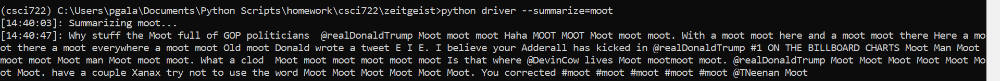

# zeitgeist
For Python 3.6+

Analyze trending twitter topics and use NLP to generate a summary

## Installation

1. Install requirements
```
pip install -r requirements.txt
```
1. Install spaCy requirements
```
python -m spacy download en
```
1. Create a file called `driver` with your Twitter API secrets, per below
```
import os
import zeitgeist

if __name__ == '__main__':
    
    os.environ['CONSUMER_KEY'] = '<CONSUMER_KEY>'
    os.environ['CONSUMER_SECRET'] = '<CONSUMER_SECRET>'
    os.environ['ACCESS_TOKEN'] = '<ACCESS_TOKEN>'
    os.environ['ACCESS_TOKEN_SECRET'] = '<ACCESS_TOKEN_SECRET>'
    
    zeitgeist.main()
```
1. Run the full program
```
python driver --full
```

## Goals

- grab corpus from live twitter data (trending hashtags)
- areas of analysis:
    - sentiment analysis of corpus (tbendlin)
        - [ ] are trending topics generally positive or negative?
        - [ ] what is the distribution of the sentiment of individual tweets?
        - [ ] can we locate particularly "outlier" tweets using sentiment?
    - topic analysis (pgalatic)
        - [x] clean data (remove urls / hashtags)
        - [ ] what tweets in this trending hashtag are the most important?
            - [ ] can we cluster tweets and then pick tweets that are representative of those clusters?
        - [ ] what is the trending hashtag about in a general sense, and can we summarize that programmaticaly?
        - [ ] what types of hashtags are more or less difficult to analyze in this way?
    - generating an "abstract" of the trending hashtag (qxh5696)
        - [ ] can we make a short paragraph describing a hashtag programmatically?
    - summary statistics
        - [ ] what words are the most common?
        - [ ] what emojis (if applicable) are the most common?
        
## Agenda

- [x] 9/19:
    - [x] pgalatic: Implement the data collection algorithm
    - [x] tbendlin: 1st draft of phase 1 report
    - [x] qxh5696: psuedocode for abstract generation algorithm + its source papers
- [x] 9/26
    - [x] pgalatic: phase 1 report edited and submitted and add data cleaning if possible
    - [x] tbendlin: plan sentiment analysis portion
    - [x] qxh5696: carryover from 9/19
- [ ] 10/10
    - [x] pgalatic: add geolocation data to scraped tweets (coordinates if possible)
    - [ ] tbendlin: add overall public opinion of tweets
    - [ ] qxh5696: hook summarization program into zeitgeist.py and process data
- [ ] 10/17
    - [ ] pgalatic: add agglomerative clustering using word vectors and cosine similarity
        - Do we want to add spellchecking for text normalization?
    - [ ] tbendlin: add kmeans/density clustering using sentiment
    - [ ] qxh5696: improve summarization
    
### Data Collection Pipeline

```
python driver --gather
```
* Data is first gathered from tweets unlceaned with these attributes IN ORDER and placed in a CSV file in ~/raw/:
    * timestamp
    * text
    * geolocation
```
python driver --purify=[HASHTAG]
```
* Data from target hashtag is extracted from ~/raw/HASHTAG.csv and preprocessed, removing:
    * stopwords
    * non-alphanumeric characters excluding ['@#]
```
python driver --cluster=[HASHTAG]
```
* Data from target hashtag is read into memory and clustered. The most representative tweets are printed to console and a visualization is saved to /report/.
```
python driver --summarize=[HASHTAG]
```
* Data from target hashtag is read into memory and summarized. The summary is then printed to console.

### Progress Snapshots

**October 3rd, 2019**

